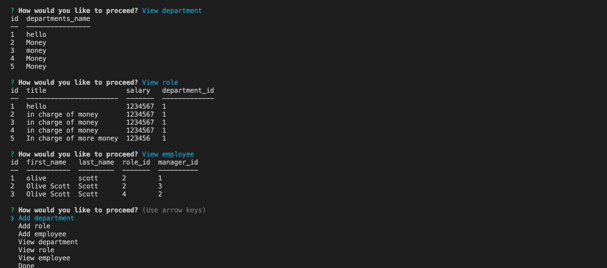

# SQL Employee Tracker

## Description

This web application gives the user the ability to manage a employee database. The user can add new employees, roles and departments. Once added the user can view view each of the categories and update.

## Table of Contents

- [Installation](#installation)
- [Usage](#Usage)
- [Links](#links)
- [Features](#features)
- [Contact](#Contact)

## Installation

- Download or clone repository
- npm install to install the required npm packages to run

## Usage

This application is a command line app and runs with node:

- In the command line type: node server.js
- Follow the prompts
- Choose done when finished

Shows tables with data:

## Links

- Github: https://github.com/nascott94/employee-tracker
- Link to video walk-thru: https://watch.screencastify.com/v/yPmKoirwNRy7xVtPq2Xe

## Contact

Contact nascott94@outlook.com for any questions.
